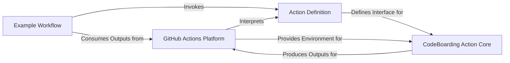

## Details

One paragraph explaining the functionality which is represented by this graph. What the main flow is and what is its purpose.

### GitHub Actions Platform
The external infrastructure provided by GitHub that executes the workflow, manages the action's environment, and handles the flow of inputs and outputs.

**Related Classes/Methods**: _None_

### Action Definition
Defines the metadata, inputs, and outputs of the `CodeBoarding-GHAction`. It serves as the primary interface and contract for how the action is used within GitHub Workflows, specifying the entry point for its execution.

**Related Classes/Methods**:

- `action.yml` (1:1)

### CodeBoarding Action Core
Encapsulates the primary functional components of the action. This includes parsing and validating inputs, executing the core "CodeBoarding" operations (e.g., code analysis, documentation generation), and preparing results to be set as outputs.

**Related Classes/Methods**: _None_

### Example Workflow
A sample GitHub Workflow that demonstrates how to invoke the `CodeBoarding-GHAction` with specific inputs and how to consume its generated outputs within a larger CI/CD pipeline.

**Related Classes/Methods**:

- `.github/workflows/example-usage.yml` (1:1)

### [FAQ](https://github.com/CodeBoarding/GeneratedOnBoardings/tree/main?tab=readme-ov-file#faq)
